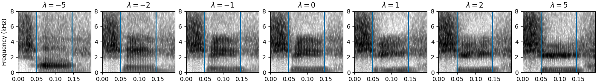
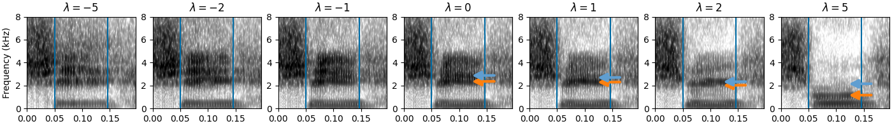
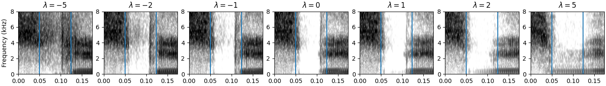
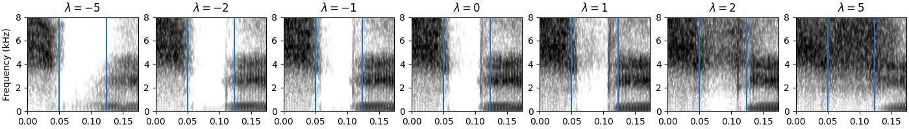
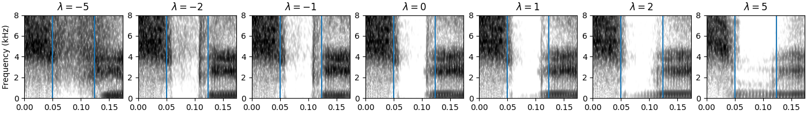

# phonetic-arithmetic

## Interactive Demo
Will be released after paper acceptance.


## Synthesis Examples

### Applying height vector to phone [i]


| λ = -5 | λ = -2 | λ = -1 | λ = 0 | λ = 1 | λ = 2 | λ = 5 |
|--------|--------|--------|-------|-------|-------|-------|
| [🎵 Audio](examples/synth-hi-i--5.wav) | [🎵 Audio](examples/synth-hi-i--2.wav) | [🎵 Audio](examples/synth-hi-i--1.wav) | [🎵 Audio](examples/synth-hi-i-0.wav) | [🎵 Audio](examples/synth-hi-i-1.wav) | [🎵 Audio](examples/synth-hi-i-2.wav) | [🎵 Audio](examples/synth-hi-i-5.wav) |

### Applying rounding vector to phone [i]


| λ = -5 | λ = -2 | λ = -1 | λ = 0 | λ = 1 | λ = 2 | λ = 5 |
|--------|--------|--------|-------|-------|-------|-------|
| [🎵 Audio](examples/synth-round-i--5.wav) | [🎵 Audio](examples/synth-round-i--2.wav) | [🎵 Audio](examples/synth-round-i--1.wav) | [🎵 Audio](examples/synth-round-i-0.wav) | [🎵 Audio](examples/synth-round-i-1.wav) | [🎵 Audio](examples/synth-round-i-2.wav) | [🎵 Audio](examples/synth-round-i-5.wav) |

### Applying nasal vector to phone [b]


| λ = -5 | λ = -2 | λ = -1 | λ = 0 | λ = 1 | λ = 2 | λ = 5 |
|--------|--------|--------|-------|-------|-------|-------|
| [🎵 Audio](examples/synth-nas-b--5.wav) | [🎵 Audio](examples/synth-nas-b--2.wav) | [🎵 Audio](examples/synth-nas-b--1.wav) | [🎵 Audio](examples/synth-nas-b-0.wav) | [🎵 Audio](examples/synth-nas-b-1.wav) | [🎵 Audio](examples/synth-nas-b-2.wav) | [🎵 Audio](examples/synth-nas-b-5.wav) |

### Applying strident vector to phone [b]


| λ = -5 | λ = -2 | λ = -1 | λ = 0 | λ = 1 | λ = 2 | λ = 5 |
|--------|--------|--------|-------|-------|-------|-------|
| [🎵 Audio](examples/synth-strid-b--5.wav) | [🎵 Audio](examples/synth-strid-b--2.wav) | [🎵 Audio](examples/synth-strid-b--1.wav) | [🎵 Audio](examples/synth-strid-b-0.wav) | [🎵 Audio](examples/synth-strid-b-1.wav) | [🎵 Audio](examples/synth-strid-b-2.wav) | [🎵 Audio](examples/synth-strid-b-5.wav) |

### Applying voicing vector to phone [b]


| λ = -5 | λ = -2 | λ = -1 | λ = 0 | λ = 1 | λ = 2 | λ = 5 |
|--------|--------|--------|-------|-------|-------|-------|
| [🎵 Audio](examples/synth-voi-b--5.wav) | [🎵 Audio](examples/synth-voi-b--2.wav) | [🎵 Audio](examples/synth-voi-b--1.wav) | [🎵 Audio](examples/synth-voi-b-0.wav) | [🎵 Audio](examples/synth-voi-b-1.wav) | [🎵 Audio](examples/synth-voi-b-2.wav) | [🎵 Audio](examples/synth-voi-b-5.wav) |


## Install
```bash
micromamba install -y python=3.10 pytorch pytorch-cuda=12.* -c pytorch -c nvidia -c conda-forge
pip install transformers==4.35.0 pandas>2 librosa>0.10 numpy==1.23.5 datasets praatio panphon scipy tqdm praat-parselmouth

# For synthesis experiments
pip install git+https://github.com/juice500ml/vocos.git@wavlm
```

## Prepare dataset
Note. Dataset has to be already downloaded in `data/` folder.
Check `data/download.sh` for more details.

```bash
dataset="timit" # or "voxangeles"
python3 prepare_datasets.py \
  --dataset_path "data/${dataset}" \
  --dataset_type $dataset \
  --output_path feats
```

## Extract self-supervised speech models' layerwise representations
```bash
# Any transformers model should work
# ex. facebook/hubert-large-ll60k facebook/wav2vec2-large-lv60 facebook/wav2vec2-large-xlsr-53 facebook/wav2vec2-xlsr-53-espeak-cv-ft
model="microsoft/wavlm-large"
model_name="wavlm-large"
dataset="timit"

# Self-supervised representations
for i in {0..24}
do
  # Feature-slicing
  CUDA_VISIBLE_DEVICES=2 python3 extract_features.py \
    --model $model \
    --dataset_csv "feats/${dataset}.csv" \
    --output_path "feats/${dataset}-${model_name}-${i}-featslice.pkl" \
    --device cuda:0 \
    --layer_index $i \
    --pool average

  # Audio-slicing
  python3 extract_features.py \
    --model $model \
    --dataset_csv "feats/${dataset}.csv" \
    --output_path "feats/${dataset}-${model_name}-${i}-audioslice.pkl" \
    --device cuda:0 \
    --layer_index $i \
    --pool average \
    --slice
done
```

## Extract traditional speech features
```bash
# Use --split both to extract features of both train/test split. It defaults to test.

dataset="timit"
model="mfcc" # or "melspec" or "mfcc-vocos" (for synth experiments)

# Feature-slicing
python3 extract_features.py \
  --model $model \
  --dataset_csv "feats/${dataset}.csv" \
  --output_path "feats/${dataset}-${model}-0-featslice.pkl" \
  --device cpu \
  --pool average

# Audio-slicing
python3 extract_features.py \
  --model $model \
  --dataset_csv "feats/${dataset}.csv" \
  --output_path "feats/${dataset}-${model}-0-audioslice.pkl" \
  --device cpu \
  --pool average \
  --slice

```

## Estimate cosine similarities between representations
```bash
python3 estimate_similarity.py \
    --model wavlm-large \
    --slice featslice \
    --dataset timit
```

## Synthesis experiments
To train the vocoder, refer to: https://github.com/juice500ml/vocos/tree/wavlm

```bash
# For VoxAngeles, use --synth_model juice500/vocos-wavlm-fleursr
# For MFCC, use --model mfcc AND --synth_model juice500/vocos-wavlm-libritts or juice500/vocos-wavlm-fleusr AND --feats feats/timit-mfcc-vocos-audioslice.pkl

# Consonants
feats=(voi strid nas son)
for i in "${!feats[@]}"; do
  target_feature=${feats[$i]}
  python3 analyze_synth.py --feats feats/timit-wavlm-large-24-featslice.pkl \
    --target_feature $target_feature --fixed_features cons+ \
    --output_path feats/timit-wavlm-synth-consonant-${target_feature}.csv \
    --device cuda:0 --model microsoft/wavlm-large \
    --synth_model juice500/vocos-wavlm-libritts
done

# Vowels
features2=(hi lo back round)
for i in "${!features2[@]}"; do
  target_feature=${features2[$i]}
  python3 analyze_synth.py --feats feats/timit-wavlm-large-24-featslice.pkl \
    --target_feature $target_feature --fixed_features cons- \
    --output_path feats/timit-wavlm-synth-vowel-${target_feature}.csv \
    --device cuda:0 --model microsoft/wavlm-large \
    --synth_model juice500/vocos-wavlm-libritts
```

## Plot all figures
```bash
python3 plot_everything.py

# For synthesizing above demo audios and spectrograms, run:
python3 plot_synth.py
```
